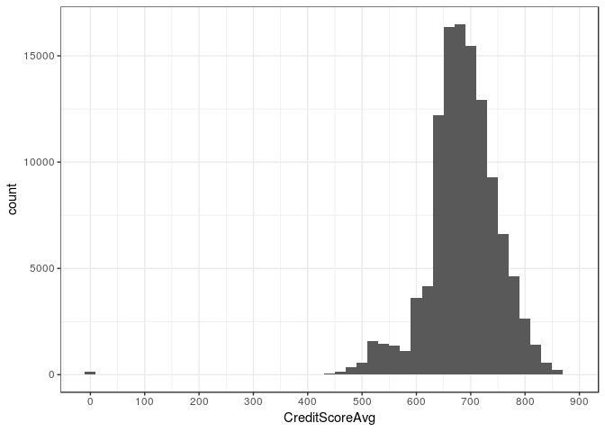

Prosper Loan EDA
================
Jabez

Introduction
------------

Prosper is the first peer-to-peer lending marketplace in the United States. Since its founding in 2005, it has facilitated more than $12 billion in loans.

### Notable Changes

#### Restrictions

Prosper became SEC registered in July 2009.

New prospective borrowers were required to have a FICO 8 credit score of at least 640, while returning borrowers required 600.

Borrowers were restricted to those residing in 47 states (Iowa, Maine, North Dakota restricted).

Lenders were restricted to residents of 28 US states and the District of Columbia.

#### Business Model

Prior to 19 December 2010, it ran as an online auction market place, where lenders and borrowers ultimately determined the loan rates, using a dutch auction-like system.

Effective 19 December 2010, Prosper used pre-set rates determined by them, evaluating each prospective borrowers credit risk.

### About the Data

The data set contains over 110,000 loan records and over 80 variables, from 2005 to 2014 Q1. It has information on loan dates, loan statuses, borrower's background, loan ratings and loan rates.

#### Modified Data

Noting the changes to Prosper above, I have combined loan ratings post and pre SEC registration (July 2009) into one variable "Rating". And have also created 2 variables to note the different time periods.

Other than those, the following variables were added:

-   Closed - closed or open loan status
-   CreditScoreAvg - average credit score using lower and upper range
-   PropMonthly - MonthlyLoanPayment/StatedMonthlyIncome
-   PropMonthlyBin - binning PropMonthly

Analysis
--------

### Loans Overview

A few questions come to mind on the topic of loans:

-   How much money they need
-   What they need it for
-   What is their income

    ##    Min. 1st Qu.  Median    Mean 3rd Qu.    Max. 
    ##    1000    4000    6500    8337   12000   35000

    ##      Not Available Debt Consolidation   Home Improvement 
    ##              16965              58308               7433 
    ##           Business      Personal Loan        Student Use 
    ##               7189               2395                756 
    ##               Auto              Other    Baby & Adoption 
    ##               2572              10494                199 
    ##               Boat Cosmetic Procedure    Engagement Ring 
    ##                 85                 91                217 
    ##        Green Loans Household Expenses    Large Purchases 
    ##                 59               1996                876 
    ##     Medical/Dental         Motorcycle                 RV 
    ##               1522                304                 52 
    ##              Taxes           Vacation      Wedding Loans 
    ##                885                768                771

    ##             $0      $1-24,999 $25,000-49,999 $50,000-74,999 $75,000-99,999 
    ##            621           7274          32192          31050          16916 
    ##      $100,000+   Not employed  Not displayed 
    ##          17337            806           7741

There's a large range of the amounts people are looking to borrow 1k-35k. It looks like most people borrow by the thousand. Why the large bar at 4k? Is there a special rate?

Most people are taking out loans as debt consolidation, could the borrowing rates on prosper be lower than the rates outside? The other four 0 - Not available, 7 - Other, 2 - Home improvement, 3 - Business

### Rates and Ratings

Let's dig a little deeper and find out more about our borrowers, also, lets take a look at the rates they are paying. Are they better on prosper, or could they not get a loan elsewhere? (Note: rates outside are about 6% - 36%)

    ##    Min. 1st Qu.  Median    Mean 3rd Qu.    Max. 
    ##  0.0000  0.1340  0.1840  0.1928  0.2500  0.4975

    ##    Min. 1st Qu.  Median    Mean 3rd Qu.    Max. 
    ## -0.0100  0.1242  0.1730  0.1827  0.2400  0.4925

    ##    Min. 1st Qu.  Median    Mean 3rd Qu.    Max.    NA's 
    ##     9.5   669.5   689.5   695.1   729.5   889.5     591

    ##    Min. 1st Qu.  Median    Mean 3rd Qu.    Max.    NA's 
    ## 0.00000 0.02859 0.04962     Inf 0.07865     Inf      15

    ##    Min. 1st Qu.  Median    Mean 3rd Qu.    Max.    NA's 
    ##   0.000   0.140   0.220   0.276   0.320  10.010    8554

    ##    AA     A     B     C     D     E    HR  NA's 
    ##  8881 17866 19970 23994 19427 13084 10443   272

Borrower rate ranges from 0.04-0.5, while lender yield ranges from 0-0.5. Lender yield is just a slight shift from the borrower rates, it makes sense as prosper charges a fee. Seems like the rates aren't too far off from the norm.

Looks like most have a minimum credit score around 600-640, which is expected because of the restrictions.

Most people expect to pay use up less than 10% of their monthly income to pay for the loan. There's some that would pay more than their income, I wonder how they are going to do that?

Most people have a debt to income ratio below 0.5, there are some exceeding 1.5, and some even exceeding 10.

### Loan Statuses

When were the loans made? Did they pay their loans?

    ## Loan Status Summary
    ##             ChargedOff              Defaulted                PastDue 
    ##                  11992                   5018                   2067 
    ##                Current FinalPaymentInProgress              Completed 
    ##                  56576                    205                  38074 
    ##              Cancelled 
    ##                      5

    ##    Min. 1st Qu.  Median    Mean 3rd Qu.    Max. 
    ##  -954.5     0.0     0.0   681.4     0.0 25000.0

There is a dip 2008 Q4 to 2009 Q2, post-financial crisis and possibly due to the SEC registration?

A big portion of the loans are still current, it seems like about 30% of the closed loans were charged off or defaulted.

For the loans which are considered closed, most losses were kept under 5000.

### Determining Rating

The first thing that we usually look at is the rating of a product, what does Prosper use to determine their ratings?

There are less HR in the higher income group, and also less AA in the lower income group.

Doesn't seem like there's too much of a relation here, it seems most have debt to income ratios below 1. The variance does seem higher for lower ratings.

There is a clear distinction here, higher credit scores do help give a higher rating.

Doesn't seem like there's much of a relation between rating and the proportion of monthly loan payment of monthly income.

### Other Relations

Do people with more income need more money? Would people with their income below their monthly repayment be able to pay their loans? Since rating is one of the first things we would look at, does it determine the outcome of the loan?

Loans for those below the 100k income range seem to max out at 25k. Can see that the higher income one has, the more one can borrow.

Surprising how some expecting to pay more than their monthly income managed to complete their loan payments. Perhaps they were expecting a payout or had funds tied up for the moment.

Can see that the better ratings have less charged off and defaulted. This should be expected!

### Loan Statuses Revisted

Are borrowers who get better rates more likely to pay their loans? Is a high income a factor to consider?

Lender yield vs borrow rate is pretty much to be expected. The higher the rate for the borrower, the higher yield for the lender. Looks like there are loans being completed at all levels.

Seems clear that the rating does determine a borrowers rate. There are some outliers with about 0% even at HR. Can see that for the current loans, the ratings and borrower rates are highly related.

Pre-SEC there were a lot of not-displayed income ranges. Few HR-100k+ incomes in the pre-sec period. And few AA-sub25k incomes after the SEC registration. But it doesn't seem like the income affects how likely the loan is paid back.

------------------------------------------------------------------------

Final Plots and Summary
-----------------------

### Rates - Auction vs Fixed

With the auction system, it looks like rates and ratings are all over! There are some HR ratings with almost 0% interest rate for the borrower. Looks like there are some really kind souls out there!

After the business model change, the borrower rate is pretty much tied in with his or her credit rating. From about 5% for an AA rating, to about 36% for a HR rating.

### Rating vs Borrower Rate + Loan Status (Closed Loans)

With the auction system, we can see the loan statuses are all over. Some which have favourable rates are also defaulting on their loans.

It seems like the lower the rates one is getting, the more likely the loan is paid off. Those with the higher rates in each rating group seems to be more likely to default.

### Proportion of Monthly Income vs Rating + Loan Status (Closed Loans)

With both the auction and fixed rates, we can see that the loan is more likely to be paid of if it has a reasonable monthly proportion and a high rating!

### Summary

    ## Closed Loans Status Auction
    ##             ChargedOff              Defaulted                PastDue 
    ##                   7598                   4266                      0 
    ##                Current FinalPaymentInProgress              Completed 
    ##                      0                      0                  24506 
    ##              Cancelled 
    ##                      5

    ## Closed Loans Status Fixed
    ##             ChargedOff              Defaulted                PastDue 
    ##                   4394                    752                      0 
    ##                Current FinalPaymentInProgress              Completed 
    ##                      0                      0                  13568 
    ##              Cancelled 
    ##                      0

The change from auction to fixed rates has seemed to lower the defaulting rates. However the charged off rate seems about the same, if not higher.

The auction model benefitted the borrowers as some of them had gotten favourable rates even with their poor credit ratings.

The rates the borrowers are getting from Prosper don't seem much different to the rates gotten outside (6% - 36%)

References
----------

-   [Prosper Details](https://en.wikipedia.org/wiki/Prosper_Marketplace)
-   [Prosper Webpage](https://www.prosper.com/invest)
-   [Default vs Charged Off](https://help.lendingclub.com/hc/en-us/articles/%20216127747-What-is-the-difference-between-a-loan-that-is-in-default-and-a-%20loan-that-has-been-charged-off-)
-   [Within Interval](https://rdrr.io/cran/lubridate/man/within-interval.html)
-   [Dplyr Merging Columns](https://stackoverflow.com/questions/45289409/%20merge-across-two-columns-with-dplyr)
-   [Colors in R](http://www.sthda.com/english/wiki/colors-in-r)
-   [Blank cells to NA](https://stackoverflow.com/questions/24172111/%20change-the-blank-cells-to-na)
-   [Plot Size](https://stackoverflow.com/questions/17963962/%20plot-size-and-resolution-with-r-markdown-knitr-pandoc-beamer)
-   Other R Documentation and Cheat Sheets at Rstudio.com

------------------------------------------------------------------------

Reflection
----------

### Personal

-   Had to do quite a bit of background research, no idea what Prosper was and some of the terms used in the data set
-   ggplot2 was surprisingly easy to use
-   At the start of EDA, zoomed in on two variables: rating and loan outcomes. Which resulted in not looking deeper into other variables

### Data

-   People were willing to lend out money almost interest free when given a choice
-   Some people had monthly payments larger than their monthly incomes, apart from those who were unemployed, what other reasons could there be?
-   Could look into building a model to predict loan outcomes. However would probably need more recent data as most of the data on closed loans is on the auction model
